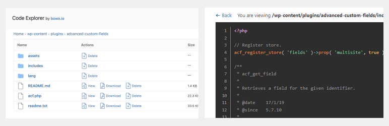
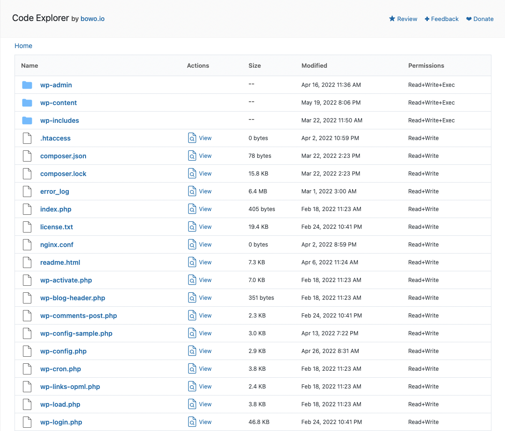
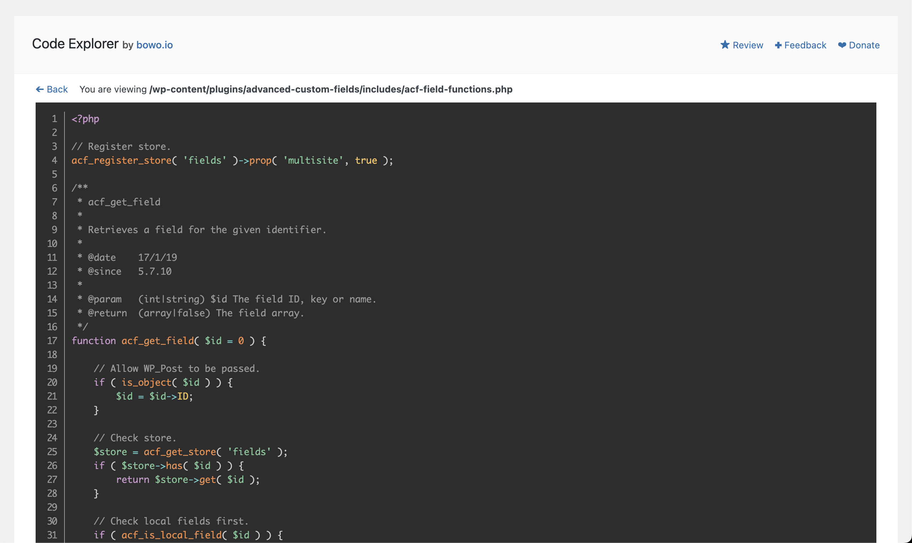

# Code Explorer

Contributors: qriouslad  
Donate link: https://paypal.me/qriouslad  
Tags: directory browser, file explorer, code viewer, developer  
Requires at least: 4.8  
Tested up to: 5.9.3  
Stable tag: 1.0.1  
Requires PHP: 5.6  
License: GPLv2 or later  
License URI: http://www.gnu.org/licenses/gpl-2.0.html

Fast directory explorer and file/code viewer with syntax highlighting.

## Description

Code Explorer allows you to swiftly browse through the directories and files in your WordPress installation. A good alternative to a full-fledged [File Manager](https://wordpress.org/plugins/wp-file-manager/) if your primary focus is **viewing directory content and the code inside the files** for your dev work, e.g. WordPress core files or theme/plugins files. 

It uses [prism.js](https://prismjs.com/) to **highlight code syntax in files** commonly used throughout the WordPress development cycle such as PHP, HTML, Javascript, CSS, JSON and Markdown files. Code Explorer is based on the [Simple File Manager](https://github.com/jcampbell1/simple-file-manager) library by [John Campbell](https://github.com/jcampbell1).

### Give Back

* [A nice review](https://wordpress.org/plugins/code-explorer/#reviews) would be great!
* [Give feedback](https://wordpress.org/support/plugin/code-explorer/) and help improve future versions.
* [Github repo](https://github.com/qriouslad/code-explorer) to contribute code.
* [Donate](https://paypal.me/qriouslad) and support my work.

## Screenshots

1. The directory explorer
   
2. The file/code viewer
   

## Frequently Asked Questions

### How was this plugin built?

Code Explorer was built with: [WordPress Plugin Boilerplate](https://github.com/devinvinson/WordPress-Plugin-Boilerplate/) | [wppb.me](https://wppb.me/) | [CodeStar framework](https://github.com/Codestar/codestar-framework)

## Changelog

### 1.0.1 (2022.04.27)

* Initial stable release. Implement directory browsing with file viewing, download and deletion.

## Upgrade Notice

None required yet.