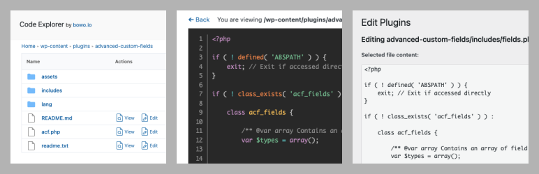

# Code Explorer

Contributors: qriouslad  
Donate link: https://paypal.me/qriouslad  
Tags: directory browser, file explorer, code viewer, developer  
Requires at least: 4.8  
Tested up to: 6.0  
Stable tag: 1.4.1  
Requires PHP: 5.6  
License: GPLv2 or later  
License URI: http://www.gnu.org/licenses/gpl-2.0.html

Fast directory explorer and file/code viewer with syntax highlighting.

## Description

Code Explorer allows you to swiftly browse through the directories and files in your WordPress installation. A good alternative to a full-fledged [File Manager](https://wordpress.org/plugins/wp-file-manager/) if your primary focus is **viewing directory content and the code inside the files** for your dev work, e.g. WordPress core files or theme/plugins files. It uses [CodeMirror](https://codemirror.net/) to **highlight code syntax in files** commonly used throughout the WordPress development cycle such as PHP, HTML, Javascript, CSS, JSON and Markdown files.

You can also edit theme and plugin files using WordPress core's file editor if it is not disabled via the DISALLOW_FILE_EDIT constant. Do proceed with great caution in editing as you can break your site if you don't know what you're doing. Since version 1.4.0, you can also create empty files and empty folders inside the /themes and /plugins folders. The files created can then be edited using core's theme/plugin editor.

### Give Back

* [A nice review](https://wordpress.org/plugins/code-explorer/#reviews) would be great!
* [Give feedback](https://wordpress.org/support/plugin/code-explorer/) and help improve future versions.
* [Github repo](https://github.com/qriouslad/code-explorer) to contribute code.
* [Donate](https://paypal.me/qriouslad) and support my work.

### Check These Out Too

* [System Dashboard](https://wordpress.org/plugins/system-dashboard/): Central dashboard to monitor various WordPress components, processes and data, including the server.
* [Variable Inspector](https://wordpress.org/plugins/variable-inspector/): Inspect PHP variables on a central dashboard in wp-admin for convenient debugging.
* [Database Admin](https://github.com/qriouslad/database-admin): Securely manage your WordPress website's database with a clean and user-friendly interface based on a custom-themed Adminer app. Only available on Github.

## Screenshots

1. The directory explorer
   
2. The file/code viewer
   

## Frequently Asked Questions

### How was this plugin built?

Code Explorer was built with: [WordPress Plugin Boilerplate](https://github.com/devinvinson/WordPress-Plugin-Boilerplate/) | [wppb.me](https://wppb.me/) | [CodeStar framework](https://github.com/Codestar/codestar-framework). Code Explorer is based on the [Simple File Manager](https://github.com/jcampbell1/simple-file-manager) library by [John Campbell](https://github.com/jcampbell1).

## Changelog

### 1.4.2 (2022.06.17)

* Full fix for "Create file" / "Create folder" buggy interaction on click
* Improve security by escaping additional HTML attributes

### 1.4.1 (2022.06.16)

* Partial fix for "Create file" / "Create folder" buggy interaction on click

### 1.4.0 (2022.06.15)

* Implement 'Delete' link on a safe list of folders and files, which exludes WP core folders and files except for the content of /plugins and /themes folders. i.e. deletion of wp-admin folder and it's content is not possible.
* Implement "Create file" and "Create folder" feature inside /themes and /plugins folders. Editing of files can then be done by core's theme/plugin editor.

### 1.3.2 (2022.06.09)

* Fix "Call to undefined function get_plugins()" error

### 1.3.1 (2022.05.26)

* Replace prism.js with CodeMirror library for syntax highlighting
* Confirm compatibility with WordPress 6.0

### 1.2.0 (2022.05.20)

* Enable editing of theme and plugin files using WordPress core's theme/plugin editor when it's not being disabled via the DISALLOW_FILE_EDIT constant.

### 1.1.0 (2022.05.19)

* Only load CSS and JS files on Code Explorer page.

### 1.0.1 (2022.04.27)

* Initial stable release. Implement directory browsing with file viewing, download and deletion.

## Upgrade Notice

None required yet.